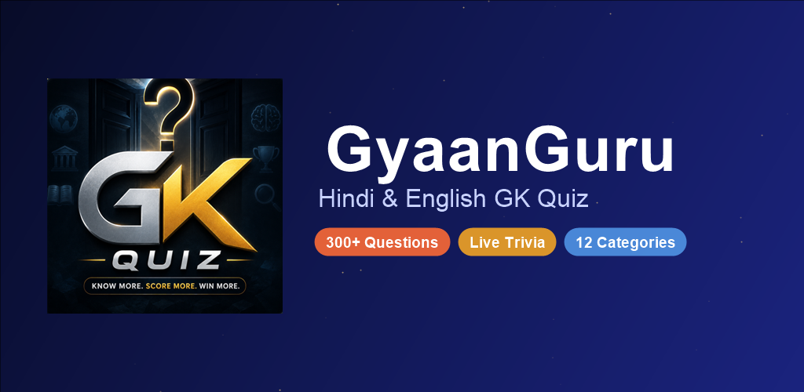
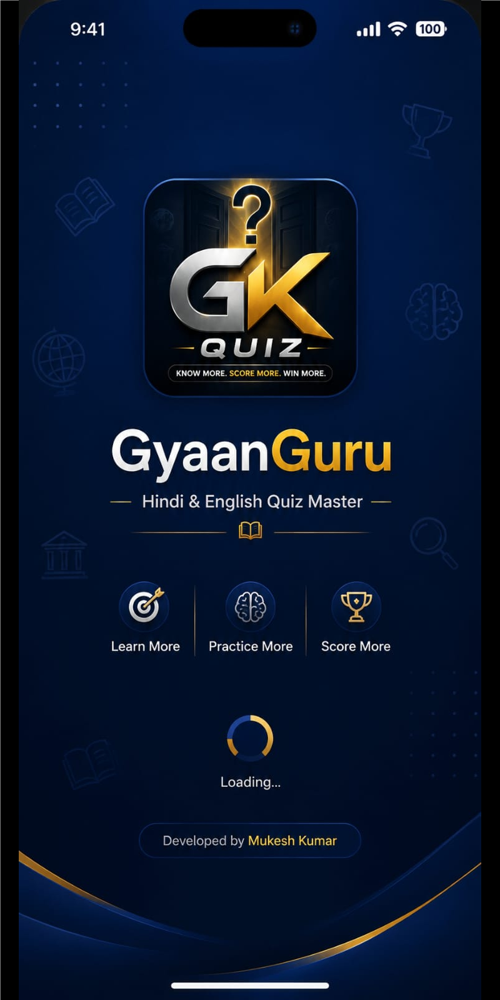
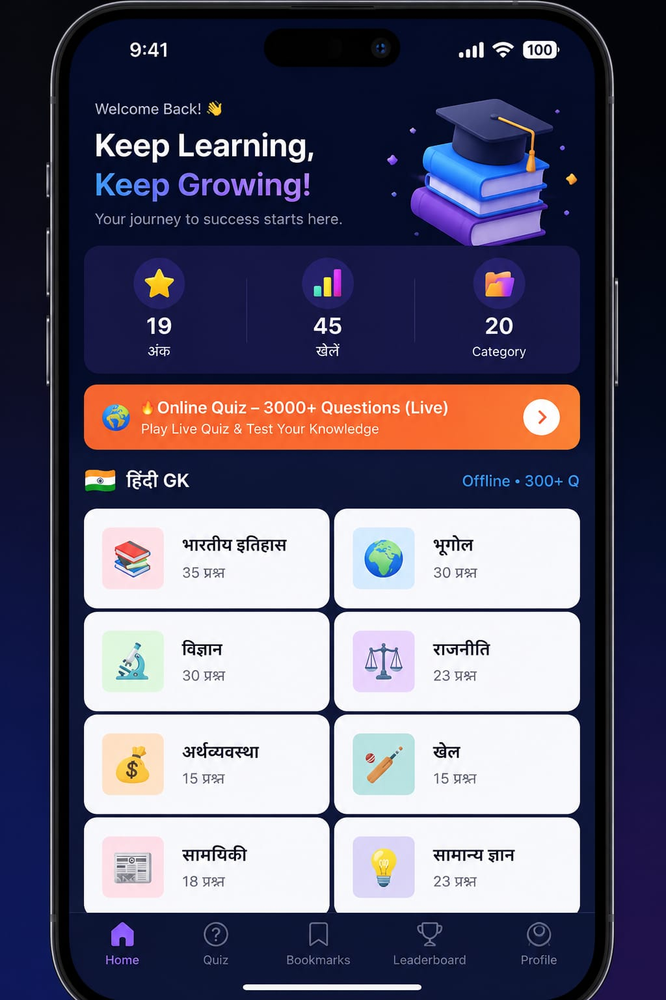
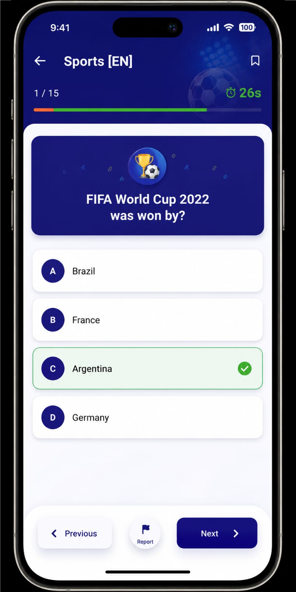

<div align="center">


# GyaanGuru — GK Quiz (Hindi & English)

**A bilingual General Knowledge quiz app for Android — 300+ hand-curated offline questions plus a live trivia mode, built fully native with zero dependencies on a backend.**

[](#)
[](#)
[](#)
[](https://play.google.com/store/apps/details?id=com.gyaanguru.quiz)
[](LICENSE)



</div>

---

## Overview

GyaanGuru is a native Android GK quiz app with **300+ questions across 12 categories** in Hindi, plus a **live Online Quiz mode** backed by the [Open Trivia Database](https://opentdb.com). No login, no ads, no analytics — scores live only on-device.

## ✨ Features

- 📚 **300+ offline questions** — Indian History, Geography, Science, Polity, Economy, Sports, Current Affairs, GK, Computers, Awards, Art & Culture, Environment
- 🌍 **Online Quiz mode** — 3000+ additional live questions with category + difficulty selection (Easy/Medium/Hard)
- ⏱️ **30-second timer** per question with live color-coded urgency
- ✅ **Instant green/red feedback** on every answer
- 📊 **Score & games-played tracking**, stored locally
- 📝 **Full answer review** after every quiz

## 📱 Screenshots

<p align="center">
  
  
  
</p>

## 🛠️ Tech Stack

- **Language:** Java
- **UI:** Native Android Views, `ConstraintLayout`, `RecyclerView`
- **Data:** Local Java data model (`QuestionBank`) for offline content; [Open Trivia DB REST API](https://opentdb.com/api_config.php) for live questions
- **Persistence:** `SharedPreferences` for score/progress
- **Build:** Gradle (AGP 8.9), R8 minification + resource shrinking on release

## 🐛 A debugging story worth telling

Category titles in the Quiz/Result screens (e.g. **भारतीय इतिहास**) were rendering as visibly garbled, reordered glyphs — but *only* on those two screens; the exact same string rendered perfectly on the Home screen and in the question body text a few pixels away. That inconsistency ruled out the obvious suspects one at a time, each confirmed with a rebuild-and-verify cycle:

1. A theme-level `android:fontFamily="sans-serif"` override — removed, bug persisted.
2. `Toolbar.setTitle()`'s internal Bidi text wrapping — replaced with a plain `TextView.setText()`, bug persisted, byte-for-byte identical.
3. The `Toolbar` widget itself — replaced with a plain `LinearLayout`, bug *still* persisted.

The decisive test: hardcoding plain ASCII text in the exact same view rendered cleanly, just with a faint overlap against the status bar clock. That pointed at the real cause — `targetSdk 36` enforces edge-to-edge display, and these two screens had no `fitsSystemWindows`/inset handling, so the title was drawing *underneath* the status bar. Devanagari's combining conjuncts and matras visibly corrupt under that kind of pixel overlap; blocky Latin capitals just look faintly covered and are easy to miss entirely.

**Fix:** `android:fitsSystemWindows="true"` on the affected layouts. One line, once the actual mechanism was understood — the lesson being that a rendering bug on non-Latin, complex-shaped script is sometimes a layout/insets bug wearing a font-bug costume.

## 🚀 Build it yourself

```bash
git clone https://github.com/mukeshkumar356/gyaanguru-quiz.git
cd gyaanguru-quiz
cp keystore.properties.example keystore.properties   # fill in your own signing details (optional, debug builds work without it)
./gradlew assembleDebug
```

## 📄 License

MIT — see [LICENSE](LICENSE).

---

<div align="center">

Built and maintained by **[Mukesh Kumar](https://github.com/mukeshkumar356)**

</div>
